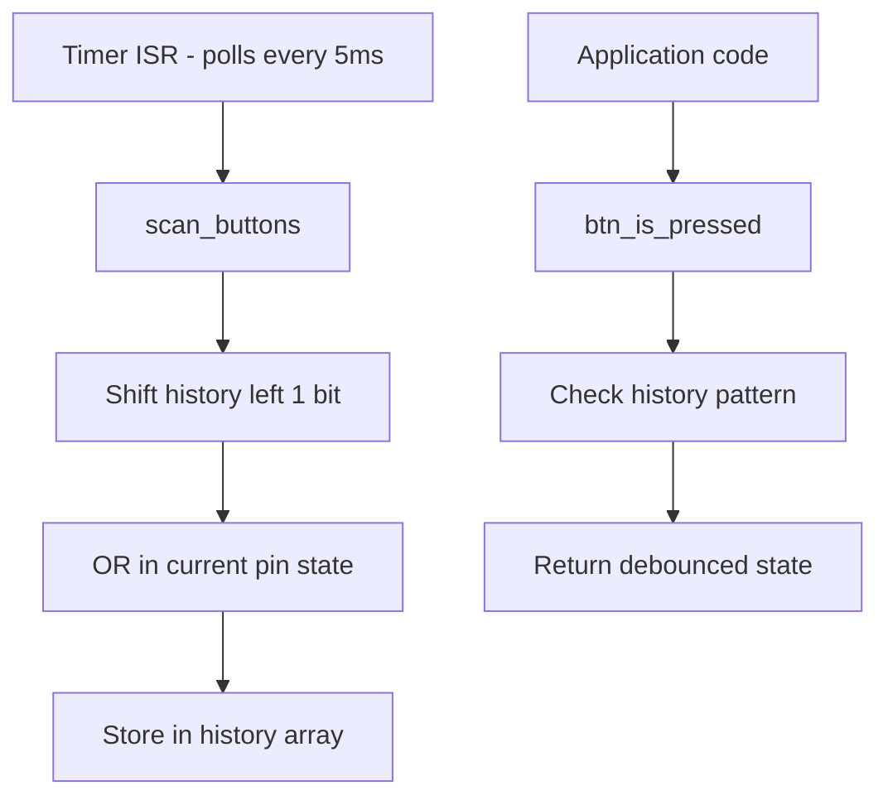

# Buttons Subsystem

Debounced button input using the "Ultimate Debouncer" pattern. Publisher/subscriber model separates polling from state queries.

## Architecture



## Publisher: scan_buttons()

Call this from a timer ISR or RTOS thread at regular intervals (5ms typical):

```c
void scan_buttons(void) {
    for (uint8_t i = 0; i < buttons.number; i++) {
        buttons.history[i] <<= 1;
        buttons.history[i] |= buttons.functions[i]();
    }
}
```

Each button maintains an 8-bit sliding window history.

## State Detection

The subscriber functions check history bit patterns:

```c
// Bit patterns (active-low buttons)
#define STATE_MASK     0b11000111
#define STATE_UP       0b11111111  // All 1s = not pressed
#define STATE_DOWN     0b00000000  // All 0s = held
#define STATE_PRESSED  0b11000000  // Rising edge pattern
#define STATE_RELEASED 0b00000111  // Falling edge pattern
```

## Subscriber Functions

| Function | Meaning | Pattern |
|----------|---------|---------|
| `btn_is_down(btn)` | Currently held | All 8 bits = 0 |
| `btn_is_up(btn)` | Not pressed | All 8 bits = 1 |
| `btn_is_pressed(btn)` | Rising edge | `11xxxx000` |
| `btn_is_released(btn)` | Falling edge | `000xxxx11` |

## Initialization

```c
// 1. Define button reader functions
button_check_t myButtons[] = {
    read_BUTTON_A,
    read_BUTTON_B,
};

// 2. Initialize with count and function array
void buttons_init(uint8_t numButtons, button_check_t *buttonFunctions);

// 3. Configure timer to call scan_buttons() every 5ms
```

## Active-Low vs Active-High

Default patterns assume active-low buttons (common on PIC). For active-high:

```c
state_map_t active_high = new_state_map();
active_high.up = 0x00;
active_high.down = 0xFF;
active_high.pressed = 0x07;   // Falling edge for active-high
active_high.released = 0xC0;  // Rising edge for active-high
update_state_map(active_high);
```

## Usage Example

```c
void attempt_button_handling(void) {
    static system_time_t last_check = 0;
    if (time_since(last_check) < 20) return;  // 50Hz
    last_check = get_current_time();
    
    if (btn_is_pressed(BUTTON_A)) {
        // Handle button A press (fires once)
    }
    
    if (btn_is_down(BUTTON_B)) {
        // Handle button B held (continuous)
    }
}
```

## Key Files

| File | Purpose |
|------|---------|
| `buttons.c` | Implementation |
| `buttons.h` | Public interface |