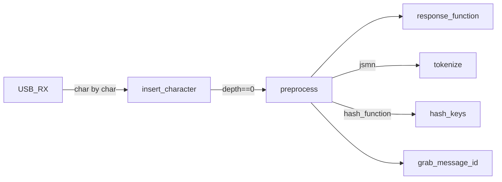

# JUDI Protocol

JSON UART Device Interface - A JSON-based protocol for structured USB/serial communication.
Gated behind `#ifdef USB_ENABLED`. Judi is the sole consumer of jsmn.

## Architecture



Inbound: characters accumulate in `json_buffer_t.data`, tracked by brace depth. When depth returns to 0, the buffer is tokenized (jsmn), keys are hashed, message ID is extracted, and the responder callback fires.

Outbound: `message_builder.c` + `json_node_t` arrays → `json_print()` → `printer_t` function pointer.

## jsmn Split

jsmn was split to eliminate the `SKIP_JUDI_ENUMS` guard (a workaround for duplicate struct definitions that broke on newer XC8):

- **`jsmn_types.h`** — `jsmntype_t` enum, `jsmntok_t` struct, `jsmnerr` enum. No configuration macros. Safe to include from any header.
- **`jsmn.h`** — includes `jsmn_types.h`, adds `jsmn_parser`, function implementations (behind `JSMN_STATIC`/`JSMN_HEADER`).

`judi.h` includes `jsmn_types.h` (with `#define JSMN_PARENT_LINKS` before it). `judi.c` includes `jsmn.h` (with `JSMN_STATIC` and `JSMN_PARENT_LINKS`). No duplicate definitions, no order-dependent guards.

## Key Lookup

`find_key(buf, obj, hash)` scans tokens for a key matching `hash` inside parent object `obj`. Returns token index, or 0 on failure. Safe by construction: gperf perfect hash guarantees no collisions, and the `hash_value_t` enum puts jsmn types at 0–4 and keywords at 5+, so token 0 (root object, hash=1) never matches any keyword.

## Hash Codegen Loop

The hash table is generated automatically on every build via cog + gperf:

1. `hash.h` contains a cog block that regex-scans the project's `src/usb/messages.c` for `hash_*` identifiers in function-call context (`(?<=hash_).*?(?=[:)])`)
2. Appends `message_id` (always needed)
3. Deduplicates, then generates `hash_function.h` (the `hash_value_t` enum) and `hash_function.c` (gperf perfect hash table + `compute_hash()`)
4. Build rule: `make` runs cog on all `@cogfiles.txt` entries before compilation

**Bootstrap loop**: you write `hash_locate` in `messages.c` (undefined symbol) → next build runs cog → cog generates the enum entry → compiler finds the symbol. Fully automatic, no manual step.

**Project-specific**: each project's `hash.h` scans its own `messages.c`. AT-200ProIIv2 has 15 keywords, MC-200 has 3. Same OS judi layer, different hash tables.

## Message Buffer

```c
typedef struct {
    char data[JSON_BUFFER_SIZE];   // 256 bytes
    uint8_t length;                // ⚠ uint8_t max 255 — off-by-one vs 256 buffer
    uint8_t depth;                 // JSON nesting level
    jsmntok_t tokens[MAX_TOKENS];  // Parsed tokens (64 max)
    int tokensParsed;
    system_time_t messageStartTime;
    system_time_t lastCharacterTime;
    union {
        struct { unsigned timedout:1; unsigned stalled:1; };
        uint8_t errors;
    };
} json_buffer_t;
```

Double-buffer infrastructure exists (`swap_active_buffer`) but `NUMBER_OF_BUFFERS=1` makes it a no-op.

## Node System (Outbound)

`json_node.h` describes JSON objects as arrays of `json_node_t` structs, serialized by `json_print(printer_t, nodeList)`. The design solves a genuine C problem: representing variable structured data with zero allocation and pointer-to-live-variable ergonomics.

```c
typedef struct {
    node_type_t type;   // selects dereference behavior at print time
    void *contents;     // pointer to C data (lives in program state, not copied)
} json_node_t;
```

The node doesn't own or copy data — it's a live view of program state. A `const` node array pointing at `&currentRF.forwardWatts` always prints the current value. No marshaling step. Node arrays are `const` — they live in ROM. The structure, keys, and control tokens cost zero RAM. Only the `void *contents` pointers reference RAM, and that's RAM already needed for program state. On PIC18 (3KB RAM, 64KB ROM), this matters — compare sprintf which needs a large RAM buffer just for formatting.

Key node types:
- **nControl** — structural markers: `"{"`, `"}"`, `"\e"` (end-of-array sentinel, GCC extension)
- **nKey** — key string, auto-appends `:`
- **nString/nFloat/nU16/nU32** — pointers to C data, serializer handles formatting and quoting
- **nNodeList** — pointer to another node array (composition/DRY — e.g. `serial_number` inside `deviceInfo`)
- **nFunction** — pointer to a function returning a node array (conditional content — e.g. `MESSAGE_ID_NODE`)

Composition enables real reuse without repeating yourself. The serializer auto-closes unmatched braces at `"\e"`, slightly easing manual node definitions. The whole system is a flat array — no tree traversal, no recursion at print time, no heap allocation, deterministic on PIC18.

Many types marked `[*]` unimplemented (nBool, nArray, nObject, nNull, nDouble, nS8–nS32, nU8, nU24). Built what was needed and stopped. The header documentation (`json_node.h`) is the best in the OS — 200 lines of tutorial with worked examples colocated with the definition.

## Protocol Implementation (per project)

JUDI is a project-agnostic OS module. The protocol-specific logic lives in each project's `src/usb/messages.c`, which defines the `respond()` callback:

- **MC-200**: handshake only (`hash_device_info`). `rfUpdate` node array defined but not sent from `respond()`.
- **AT-200ProIIv2**: full protocol — requests + commands with nested key parsing:
  - `set_relays`: finds `relays` object at root level, then searches *inside* that sub-object for `caps`/`inds`/`z` keys using `find_key(buf, relays_object + 1, hash_caps)`. The `+1` skips the "relays" key token into its value object. Two levels of nesting, enabled by `JSMN_PARENT_LINKS`.
  - `cup`/`cdn`/`lup`/`ldn`: incremental relay adjustments — the physical buttons exposed over serial. `put_relays()` updates hardware + display, `send_relay_update()` confirms to client.
  - `locate`: commented out (`// locate_device()`) — 200Pro has LEDs but not wired up yet.

Two outbound patterns coexist: static node arrays call `json_print(usb_print, rfUpdate)` directly; dynamic composition uses `add_nodes()` + `print_message(usb_print)` via the builder.

## Memory Cost

JUDI + debug UART consumes ~1590 bytes (48% of Q41's 3344 bytes RAM). Developed on PIC18F57xxx (8KB RAM) where this was ~20% — comfortable. On Q41 production targets it's prohibitive.

| Component | Bytes | Notes |
|-----------|-------|-------|
| json_buffer_t.data | 256 | Probably generous — longest message ~150 bytes |
| json_buffer_t.tokens | 704 | 64 × 11 bytes (int fields). Typical message has 10–15 tokens |
| json_buffer_t other | 13 | length, depth, tokensParsed, timestamps, errors |
| message_t | 97 | 32 nodes × 3 + length |
| UART TX ring | 255+5 | Maxed to uint8_t limit — shell doesn't need this much |
| UART RX ring | 255+5 | Same — could be smaller |

Trim opportunities: `jsmntok_t` fields from `int` to `uint8_t` (start/end/size/parent never exceed 255 for JUDI messages), `MAX_TOKENS` and `JSON_BUFFER_SIZE` configurable per project, ring buffers sized to actual need. Modifying `jsmntok_t` field types requires updating jsmn parser internals — local copy is already modified (hash field added), so this is viable.

## Shell/JUDI Multiplexing (abandoned experiment)

JUDI and the shell share the same UART stream. An experiment allowed interleaving JUDI JSON messages inside the shell character stream by depth-tracking braces: depth > 0 → character belongs to JUDI, depth == 0 → belongs to shell. The PC-side demux was `JudiFilter` (stagehand project, `codex/filters/judi_filter.py`) — a Python mirror of the embedded `insert_character()` logic with `accepted`/`rejected` callbacks for routing.

Abandoned because: the use case (single UART carrying both protocols) didn't justify the complexity. Dedicated USB serial ports make mux unnecessary. The approach also has a fragility: any stray `{` in shell output hijacks the stream until a matching `}`.

## Key Files

| File | Purpose |
|------|---------|
| `judi.c` | Main JUDI implementation (entirely `#ifdef USB_ENABLED`) |
| `judi.h` | Public API, buffer type, token macros |
| `judi_messages.c` | Message definitions and handlers |
| `message_builder.c` | Construct outgoing messages |
| `hash_function.c` | Fast string hashing for key lookup |
| `json_node.h` | Node type system (best-documented file in the OS) |
| `json_print.c` | Serializer: node arrays → JSON text via printer_t |
| `jsmn.h` | JSON parser (types + functions) |
| `jsmn_types.h` | Extracted type definitions (no config dependencies) |

## Dependencies

- `jsmn_types.h` / `jsmn.h` — JSON parser (local, modified to add `hash` field)
- `system_time` — Millisecond timestamps
- UART/USB interface (passed from project)