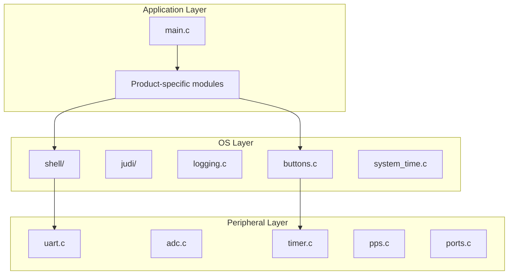

# Layer Architecture

Three-layer architecture for bare-metal PIC18 projects.

## Layer Diagram



## Layer Responsibilities

### Application Layer

The product-specific code that makes your device unique.

- Entry point (`main.c`)
- Product features (sensors, displays, actuators)
- UI logic and button handling
- Calls `startup()` then enters main loop

**Allowed to depend on:** OS layer (via interfaces), Peripheral layer (for hardware init)

**May be in submodules:** Product-specific features can be their own submodule if shared across product variants.

### OS Layer

Portable bare-metal abstractions that work across PIC18 devices.

- `shell/` - Interactive command interface
- `judi/` - JSON protocol for USB/serial
- `logging.c` - Debug logging framework
- `buttons.c` - Debounced button input
- `system_time.c` - Millisecond counter

**Allowed to depend on:** Peripheral layer (via interfaces)

**Never depends on:** Application layer

### Peripheral Layer

Low-level hardware drivers, chip-specific.

- `uart.c` - UART driver with buffer abstraction
- `adc.c` - Analog-to-digital converter
- `timer.c` - Timer configuration
- `pps.c` - Peripheral Pin Select
- `ports.c` - GPIO port configuration

**Allowed to depend on:** Chip headers only

**Never depends on:** OS layer, Application layer

## Dependency Flow

```
Application → OS → Peripherals → Chip Headers
```

Dependencies flow downward only. Never upward.

## Interface Pattern

Upper layers receive interfaces, not hardware:

```c
// Application layer
void product_init(void) {
    uart_config_t config = UART_get_config(2);
    config.baud = _115200;
    create_uart_buffers(debug, config, 255);
    
    uart_interface_t uart = UART_init(&config);
    
    // Pass interface to module that needs it
    my_module_init(&uart);
}

// OS layer (receives interface)
void my_module_init(uart_interface_t *uart) {
    // Uses uart->tx_string(), uart->rx_char(), etc.
    // Never accesses UART registers directly
}
```

## Code Organization

```
project/
├── src/
│   ├── peripherals/     # Peripheral layer (submodule)
│   │   ├── uart.c
│   │   ├── adc.c
│   │   └── ...
│   ├── os/              # OS layer (submodule)
│   │   ├── shell/
│   │   ├── buttons.c
│   │   └── ...
│   ├── main.c           # Application layer
│   ├── system.c         # Application layer
│   └── product_*.c      # Application layer
└── project.yaml         # Build configuration
```

## Why Three Layers?

| Layer | Reusability | Changes When |
|-------|-------------|--------------|
| Application | Low (product-specific) | Product changes |
| OS | High (bare-metal patterns) | New OS features |
| Peripherals | Medium (chip-specific) | New chip family |

The OS layer can be shared across all PIC18 projects. The Peripheral layer can be shared across all projects using the same chip family. Only the Application layer is truly product-specific.

## Adding a New Peripheral

1. Create driver in `src/peripherals/`
2. Add PPS configuration to driver's `_init()` function
3. Create interface struct if needed
4. Document in `peripherals/lode/`

## Adding a New OS Service

1. Create module in `src/os/`
2. Provide init function following startup pattern
3. If task-based, provide `attempt_*()` function for main loop
4. If shell commands, register with `shell_register_command()`
5. Document in `os/lode/`

## Adding Application Code

1. Create module in `src/`
2. Call init from `startup()` in correct layer
3. Add `attempt_*()` to main loop if periodic
4. Document in project lode (not submodule)