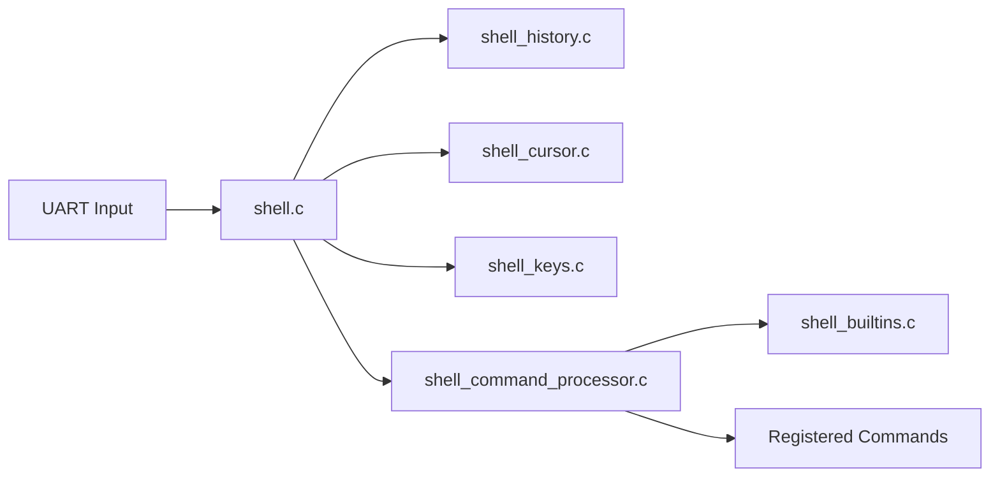

# Shell Subsystem

Interactive command shell for development builds. Disabled in release builds via preprocessor.

## Architecture



## Enabling the Shell

Add to project's build defines:

```c
// In project's shell_config.h
#define SHELL_ENABLED
#define SHELL_HISTORY_ENABLED
#define SHELL_MAX_LENGTH 64
```

## Command Registration

Register commands in your module's `_init()` function:

```c
void my_module_init(void) {
    // ... module setup ...
    
#ifdef SHELL_ENABLED
    shell_register_command(sh_mycommand, "mycommand");
#endif
}
```

## Command Signature

All shell commands use this signature:

```c
void command_name(int argc, char **argv);
```

## Pattern 1: One-Shot Commands

Execute immediately and return. Parse arguments with `argc`/`argv`:

```c
void sh_mycommand(int argc, char **argv) {
    switch (argc) {
    case 1:
        mycommand_print_usage();
        return;
    case 2:
        if (!strcmp(argv[1], "list")) {
            mycommand_list_items();
            return;
        }
        break;
    case 3:
        if (!strcmp(argv[1], "set")) {
            uint16_t value = atoi(argv[2]);
            mycommand_set(value);
            return;
        }
        break;
    }
    println("invalid arguments");
}
```

## Pattern 2: Interactive Callbacks

Enter a monitoring/control mode until user exits:

```c
int8_t my_callback(char currentChar) {
    if (currentChar == 3) {  // Ctrl-C exits
        return -1;
    }
    
    // Handle key input
    if (iscntrl(currentChar)) {
        key_t key = identify_key(currentChar);
        switch (key.key) {
        case UP:
            // increment something
            display_value();
            return 0;
        case DOWN:
            // decrement something
            display_value();
            return 0;
        }
    }
    
    return 0;  // continue running callback
}

void sh_mycommand(int argc, char **argv) {
    println("entering mycommand mode (Ctrl-C to exit)");
    shell_register_callback(my_callback);
}
```

**Callback return values:**
- `0` = continue running callback
- `-1` = exit callback mode, return to shell

## Pattern 3: Full TUI Interface

For text-based user interfaces (menus, dashboards, editors), use callback mode with terminal control sequences.

### Terminal Control Functions

From `shell_utils.h`:

```c
// Screen control
term_reset_screen()       // Clear entire screen, cursor to 0,0
term_clear_to_right()     // Clear from cursor to end of line
term_hide_cursor()        // Hide cursor during TUI
term_show_cursor()        // Show cursor again
term_cursor_set(x, y)     // Move cursor to column x, row y
term_cursor_home()        // Move cursor to column 0
term_cursor_up(n)         // Move cursor up n rows
term_cursor_down(n)       // Move cursor down n rows
term_cursor_left(n)       // Move cursor left n columns
term_cursor_right(n)      // Move cursor right n columns
```

### Text Colors and Attributes

From `shell_colors.h`:

```c
// Reset to default
TXT_RESET                 // White on black

// Text colors
TXT_RED, TXT_GREEN, TXT_BLUE, TXT_YELLOW, TXT_CYAN, TXT_MAGENTA, TXT_WHITE

// Bright variants
TXT_BR_RED, TXT_BR_GREEN, TXT_BR_BLUE, ...

// Bold variants
TXT_BOLD_RED, TXT_BOLD_GREEN, ...

// Background colors
TXT_BG_RED, TXT_BG_GREEN, TXT_BG_BLUE, ...

// Effects
TXT_BOLD, TXT_UNDERLINE

// Invert (swap foreground/background)
invert_text_attribute()   // From shell_utils.h
```

### Key Detection

Keys are identified using `identify_key()`:

```c
key_t key = identify_key(currentChar);

// Available keys (from shell_keys.h)
// UP, DOWN, LEFT, RIGHT
// HOME, END, INSERT, DELETE
// PAGEUP, PAGEDOWN
// F1 through F12
// ENTER, ESCAPE, TAB, BACKSPACE
// UNKNOWN

// Check for modifier keys
if (key.mod == CTRL) { ... }
if (key.mod == SHIFT) { ... }
```

### TUI Structure

A full TUI has three parts: setup, draw, and callback.

```c
// State for TUI
static uint8_t selected_line = 0;
static uint8_t selected_value = 0;

// Initialize state, then enter callback mode
void sh_mytui(int argc, char **argv) {
    selected_line = 0;
    selected_value = DEFAULT_VALUE;
    
    term_hide_cursor();
    draw_mytui();
    
    shell_register_callback(mytui_callback);
}

// Refresh the entire screen
void draw_mytui(void) {
    term_reset_screen();
    term_cursor_set(0, 0);
    
    print_mytui_header();
    print_mytui_list();
    print_mytui_footer();
    
    // Position cursor on selected line
    term_cursor_set(0, selected_line + HEADER_ROWS);
    invert_text_attribute();
    print_current_line();
}
```

### TUI Callback Pattern

```c
int8_t mytui_callback(char currentChar) {
    if (iscntrl(currentChar)) {
        key_t key = identify_key(currentChar);
        
        switch (key.key) {
        case UP:
            if (selected_line > 0) {
                reprint_line();          // Unhighlight current
                selected_line--;
                term_cursor_up(1);
                invert_text_attribute();
                reprint_line();          // Highlight new
            }
            return 0;
            
        case DOWN:
            if (selected_line < MAX_LINES - 1) {
                reprint_line();
                selected_line++;
                term_cursor_down(1);
                invert_text_attribute();
                reprint_line();
            }
            return 0;
            
        case ENTER:
            // Save and exit
            save_current_value();
            return -1;  // Exit callback mode
            
        case ESCAPE:
            // Exit without saving
            return -1;
            
        case F5:
            // Refresh screen
            draw_mytui();
            return 0;
        }
    }
    
    return 0;  // Continue running
}
```

### Complete TUI Example: Menu Editor

```c
// State
static uint8_t cursor_row = 0;
static uint8_t values[10];
static const uint8_t num_items = 10;

void draw_menu(void) {
    term_reset_screen();
    term_cursor_set(0, 0);
    
    println("=== Configuration Menu ===");
    println("");
    
    for (uint8_t i = 0; i < num_items; i++) {
        if (i == cursor_row) {
            invert_text_attribute();
        }
        printf("Item %d: [%3d]  %s\r\n", i, values[i], 
               i == cursor_row ? "<--" : "   ");
        if (i == cursor_row) {
            reset_text_attributes();
        }
    }
    
    println("");
    println("UP/DOWN: navigate  LEFT/RIGHT: change value");
    println("ENTER: save  ESC: cancel");
    
    // Position cursor
    term_cursor_set(0, cursor_row + 3);
}

int8_t menu_callback(char currentChar) {
    if (!iscntrl(currentChar)) return 0;
    
    key_t key = identify_key(currentChar);
    
    switch (key.key) {
    case UP:
        if (cursor_row > 0) cursor_row--;
        draw_menu();
        return 0;
    case DOWN:
        if (cursor_row < num_items - 1) cursor_row++;
        draw_menu();
        return 0;
    case LEFT:
        if (values[cursor_row] > 0) values[cursor_row]--;
        draw_menu();
        return 0;
    case RIGHT:
        if (values[cursor_row] < 255) values[cursor_row]++;
        draw_menu();
        return 0;
    case ENTER:
        term_reset_screen();
        term_show_cursor();
        println("Values saved!");
        return -1;
    case ESCAPE:
        term_reset_screen();
        term_show_cursor();
        println("Cancelled.");
        return -1;
    }
    return 0;
}

void sh_menuedit(int argc, char **argv) {
    term_hide_cursor();
    draw_menu();
    shell_register_callback(menu_callback);
}
```

## Standard Includes for Commands

```c
#include "os/serial_port.h"
#include "os/shell/shell.h"
#include "os/shell/shell_command_processor.h"
#include "os/shell/shell_command_utils.h"
#include "os/shell/shell_keys.h"
#include "os/shell/shell_utils.h"
#include <ctype.h>
#include <stdlib.h>
#include <string.h>
```

## Key Files

| File | Purpose |
|------|---------|
| `shell.c` | Main shell input loop |
| `shell_command_processor.c` | Parses and dispatches commands |
| `shell_builtins.c` | Built-in commands (help, clear, etc.) |
| `shell_history.c` | Command history navigation |
| `shell_keys.c` | Key code definitions and parsing |
| `shell_cursor.c` | Cursor movement within line editor |
| `shell_utils.h` | Terminal control macros (cursor, clear) |
| `shell_colors.h` | ANSI color and attribute codes |
| `shell_config.h` | Project-specific configuration |