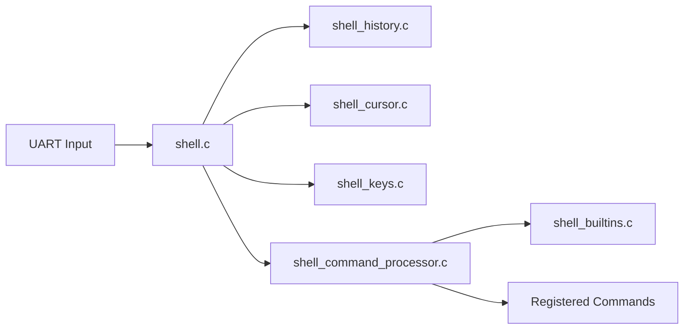

# Shell Subsystem

Interactive command shell for development builds. Disabled in release builds via preprocessor.

## Architecture



## Enabling the Shell

Add to project's build defines:

```c
// In project's shell_config.h
#define SHELL_ENABLED
#define SHELL_HISTORY_ENABLED
#define SHELL_MAX_LENGTH 64
```

## Command Registration

Register commands in your module's `_init()` function:

```c
void my_module_init(void) {
    // ... module setup ...
    
#ifdef SHELL_ENABLED
    shell_register_command(sh_mycommand, "mycommand");
#endif
}
```

## Command Signature

All shell commands use this signature:

```c
void command_name(int argc, char **argv);
```

## Pattern 1: One-Shot Commands

Execute immediately and return. Parse arguments with `argc`/`argv`:

```c
void sh_mycommand(int argc, char **argv) {
    switch (argc) {
    case 1:
        mycommand_print_usage();
        return;
    case 2:
        if (!strcmp(argv[1], "list")) {
            mycommand_list_items();
            return;
        }
        break;
    case 3:
        if (!strcmp(argv[1], "set")) {
            uint16_t value = atoi(argv[2]);
            mycommand_set(value);
            return;
        }
        break;
    }
    println("invalid arguments");
}
```

## Pattern 2: Interactive Callbacks

Enter a monitoring/control mode until user exits:

```c
int8_t my_callback(char currentChar) {
    if (currentChar == 3) {  // Ctrl-C exits
        return -1;
    }
    
    // Handle key input
    if (iscntrl(currentChar)) {
        key_t key = identify_key(currentChar);
        switch (key.key) {
        case UP:
            // increment something
            display_value();
            return 0;
        case DOWN:
            // decrement something
            display_value();
            return 0;
        }
    }
    
    return 0;  // continue running callback
}

void sh_mycommand(int argc, char **argv) {
    println("entering mycommand mode (Ctrl-C to exit)");
    shell_register_callback(my_callback);
}
```

**Callback return values:**
- `0` = continue running callback
- `-1` = exit callback mode, return to shell

## Standard Includes for Commands

```c
#include "os/serial_port.h"
#include "os/shell/shell.h"
#include "os/shell/shell_command_processor.h"
#include "os/shell/shell_command_utils.h"
#include "os/shell/shell_keys.h"
#include "os/shell/shell_utils.h"
#include <ctype.h>
#include <stdlib.h>
#include <string.h>
```

## Key Files

| File | Purpose |
|------|---------|
| `shell.c` | Main shell input loop |
| `shell_command_processor.c` | Parses and dispatches commands |
| `shell_builtins.c` | Built-in commands (help, clear, etc.) |
| `shell_history.c` | Command history navigation |
| `shell_keys.c` | Key code definitions |
| `shell_cursor.c` | Cursor movement utilities |
| `shell_config.h` | Project-specific configuration (MAX_LENGTH, etc.) |