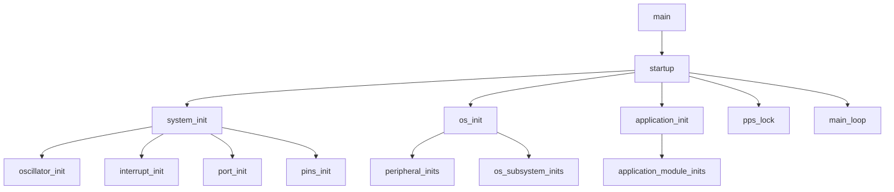

# Startup Sequence

Layered initialization pattern for bare-metal PIC18 systems.

## Initialization Order



## The Pattern

### 1. System Init (Hardware Layer)

```c
void system_init(void) {
    oscillator_init();    // Clock must be stable first
    interrupt_init();      // Enable interrupts
    port_init();           // Default PORTx states
    pins_init();           // TRIS/ANSEL configuration
}
```

### 2. OS Init (Services Layer)

```c
void os_init(void) {
    uart_init(&debug_config);   // UART for shell/logging
    shell_init();                // If SHELL_ENABLED
    buttons_init();             // Button subsystem
    button_isr_init();           // Timer ISR for button scanning
    logging_init();             // If LOGGING_ENABLED
    system_time_init();          // NCO/SMT for millisecond counter
}
```

### 3. Application Init (Product Layer)

```c
void application_init(void) {
    sensor_init();      // Product-specific sensors
    display_init();     // Product-specific outputs
    ui_init();          // Product-specific UI
}
```

### 4. PPS Lock

```c
void startup(void) {
    system_init();
    os_init();
    application_init();
    pps_lock();         // Lock once, after all modules initialized
}
```

## Main Loop Entry

After `startup()` completes:

```c
void main(void) {
    startup();
    main_loop();  // Never returns
}

void main_loop(void) {
    while (1) {
        attempt_task_1();
        attempt_task_2();
        // ...
    }
}
```

## Key Invariants

1. **Oscillator first** - Clock must be stable before any peripheral init
2. **PPS before use** - Each module calls PPS functions in its init
3. **PPS lock last** - `pps_lock()` called once before main loop
4. **No blocking in init** - Init functions should complete quickly

## Module Init Signature

Each module follows this pattern:

```c
// In module header
void module_init(void);

// In module source
void module_init(void) {
    // 1. Configure peripheral registers
    // 2. Set up PPS if needed
    // 3. Initialize state variables
    // 4. Register with OS services (shell commands, etc.)
}
```

## PPS Configuration

Each module configures its own PPS pins:

```c
void uart_module_init(void) {
    // Module owns its PPS configuration
    pps_in_UART1_RX(PPS_DEBUG_RX_PIN);
    pps_out_UART1_TX(PPS_DEBUG_TX_PIN);
    
    // Then initialize peripheral
    UART_init(&config);
}

// PPS locked once in startup
void startup(void) {
    // ... inits ...
    pps_lock();  // No more PPS changes
}
```

## Conditional Initialization

Use preprocessor for optional features:

```c
void os_init(void) {
    system_time_init();  // Always needed
    
#ifdef SHELL_ENABLED
    shell_init();
#endif

#ifdef LOGGING_ENABLED
    logging_init();
#endif
}
```

## Related Files

| File | Purpose |
|------|---------|
| `system.c` | Startup orchestration |
| `peripherals/pps.c` | PPS lock/unlock |
| `os/system_time.c` | Millisecond counter |

## Related Documentation

- [superloop.md](superloop.md) - The main loop pattern
- [../peripherals/pps.md](../peripherals/pps.md) - Peripheral Pin Select