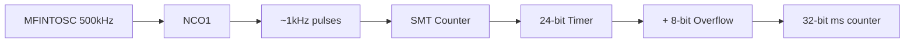

# System Time

Precise millisecond timing using NCO (Numerically Controlled Oscillator) and SMT (Signal Measurement Timer).

## Hardware Configuration

PIC18 Q41 devices have NCO and SMT peripherals that combine to create a 32-bit millisecond counter:



## Configuration

```c
void system_time_init(void) {
    // NCO generates ~1kHz pulse train
    nco1_set_pulse_frequency_mode(NCO_MODE_PULSE_FREQUENCY);
    nco1_set_clock_source(NCO_CLOCK_SOURCE_MFINTOSC_500);
    nco1_set_incrementor(0x000831);  // Tuned for 1ms
    
    // SMT counts NCO pulses
    smt_set_operation_mode(SMT_MODE_COUNTER);
    smt_set_signal_input(SMT_SIGNAL_INPUT_NCO1);
    smt_interrupt_enable();
    smt_start();
}
```

## Time Type

```c
typedef uint32_t system_time_t;  // Milliseconds since boot (~49.7 day range)
```

## Reading Time

```c
system_time_t get_current_time(void) {
    smt_interrupt_disable();
    smt_latch_now();  // Atomic 24-bit snapshot
    
    system_time_t currentTime = smtOverflowCount;  // Upper 8 bits
    currentTime <<= 24;
    currentTime += smt_read();  // Lower 24 bits
    
    smt_interrupt_enable();
    return currentTime;
}
```

## Time Since Pattern

Handles 32-bit overflow correctly:

```c
system_time_t time_since(system_time_t startTime) {
    return get_current_time() - startTime;
}

// Usage
if (time_since(last_update) >= interval_ms) {
    last_update = get_current_time();
    // do work
}
```

## Delay Functions

### Blocking Delays

```c
void delay_us(uint16_t microSeconds);  // Approximate busy-wait
void delay_ms(system_time_t milliSeconds);  // Blocking millisecond delay
```

For non-blocking delays, use `time_since()` pattern instead.

## ISR

```c
volatile uint8_t smtOverflowCount;

void __interrupt(irq(SMT1), high_priority) SMT_overflow_ISR() {
    smt_clear_interrupt_flag();
    smtOverflowCount++;  // Increments every ~16.7 seconds
}
```

## Shell Commands (Development Builds)

- `clockmon` - Monitor the clock counter
- `uptime` - Show uptime in D:H:M:S format

## Key Files

| File | Purpose |
|------|---------|
| `system_time.c` | Implementation |
| `system_time.h` | Public interface |