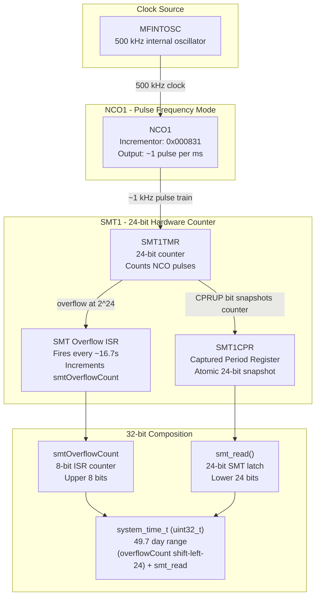
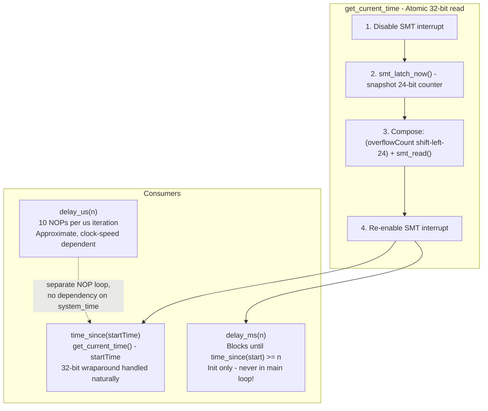

# System Time

Precise millisecond timing using NCO (Numerically Controlled Oscillator) and SMT (Signal Measurement Timer).

## Origin

This module was spite-driven development. "There's no way I'm servicing a fucking
interrupt 1k times per second" → read the PIC datasheet → discovered NCO can generate
a pulse train that the SMT counts autonomously. Result: the only ISR fires every ~4.66
hours (SMT overflow), and time still counts during critical sections where interrupts
are disabled. The hardware does the work; the CPU doesn't.

## Hardware Configuration

PIC18 Q41 devices have NCO and SMT peripherals that combine to create a 32-bit millisecond counter:


```mermaid
flowchart TD
    subgraph Clock Source
        MFINTOSC["MFINTOSC<br/>500 kHz internal oscillator"]
    end

    subgraph NCO1 - Pulse Frequency Mode
        NCO["NCO1<br/>Incrementor: 0x000831<br/>Output: ~1 pulse per ms"]
    end

    subgraph SMT1 - 24-bit Hardware Counter
        SMT_COUNTER["SMT1TMR<br/>24-bit counter<br/>Counts NCO pulses"]
        SMT_LATCH["SMT1CPR<br/>Captured Period Register<br/>Atomic 24-bit snapshot"]
        SMT_OVERFLOW["SMT Overflow ISR<br/>Fires every ~16.7s<br/>Increments smtOverflowCount"]
    end

    subgraph 32-bit Composition
        UPPER["smtOverflowCount<br/>8-bit ISR counter<br/>Upper 8 bits"]
        LOWER["smt_read()<br/>24-bit SMT latch<br/>Lower 24 bits"]
        RESULT["system_time_t (uint32_t)<br/>49.7 day range<br/>(overflowCount shift-left-24) + smt_read"]
    end

    MFINTOSC -->|"500 kHz clock"| NCO
    NCO -->|"~1 kHz pulse train"| SMT_COUNTER
    SMT_COUNTER -->|"CPRUP bit snapshots counter"| SMT_LATCH
    SMT_COUNTER -->|"overflow at 2^24"| SMT_OVERFLOW
    SMT_OVERFLOW --> UPPER
    SMT_LATCH --> LOWER
    UPPER --> RESULT
    LOWER --> RESULT
```

## Reading and Consuming Time


```mermaid
flowchart TD
    subgraph get_current_time - Atomic 32-bit read
        STEP1["1. Disable SMT interrupt"]
        STEP2["2. smt_latch_now() - snapshot 24-bit counter"]
        STEP3["3. Compose: (overflowCount shift-left-24) + smt_read()"]
        STEP4["4. Re-enable SMT interrupt"]
        STEP1 --> STEP2 --> STEP3 --> STEP4
    end

    subgraph Consumers
        TIME_SINCE["time_since(startTime)<br/>get_current_time() - startTime<br/>32-bit wraparound handled naturally"]
        DELAY_MS["delay_ms(n)<br/>Blocks until time_since(start) >= n<br/>Init only - never in main loop!"]
        DELAY_US["delay_us(n)<br/>10 NOPs per us iteration<br/>Approximate, clock-speed dependent"]
    end

    STEP4 --> TIME_SINCE
    STEP4 --> DELAY_MS
    DELAY_US -.->|"separate NOP loop,<br/>no dependency on system_time"| TIME_SINCE
```

## Configuration

```c
void system_time_init(void) {
    // NCO generates ~1kHz pulse train
    nco1_set_pulse_frequency_mode(NCO_MODE_PULSE_FREQUENCY);
    nco1_set_clock_source(NCO_CLOCK_SOURCE_MFINTOSC_500);
    nco1_set_incrementor(0x000831);  // Tuned for 1ms
    
    // SMT counts NCO pulses
    smt_set_operation_mode(SMT_MODE_COUNTER);
    smt_set_signal_input(SMT_SIGNAL_INPUT_NCO1);
    smt_interrupt_enable();
    smt_start();
}
```

## Time Type

```c
typedef uint32_t system_time_t;  // Milliseconds since boot (~49.7 day range)
```

## Reading Time

```c
system_time_t get_current_time(void) {
    smt_interrupt_disable();
    smt_latch_now();  // Atomic 24-bit snapshot
    
    system_time_t currentTime = smtOverflowCount;  // Upper 8 bits
    currentTime <<= 24;
    currentTime += smt_read();  // Lower 24 bits
    
    smt_interrupt_enable();
    return currentTime;
}
```

## Time Since Pattern

Handles 32-bit overflow correctly:

```c
system_time_t time_since(system_time_t startTime) {
    return get_current_time() - startTime;
}

// Usage
if (time_since(last_update) >= interval_ms) {
    last_update = get_current_time();
    // do work
}
```

## Delay Functions

### Blocking Delays

```c
void delay_us(uint16_t microSeconds);  // Approximate busy-wait
void delay_ms(system_time_t milliSeconds);  // Blocking millisecond delay
```

For non-blocking delays, use `time_since()` pattern instead.

## ISR

```c
volatile uint8_t smtOverflowCount;

void __interrupt(irq(SMT1), high_priority) SMT_overflow_ISR() {
    smt_clear_interrupt_flag();
    smtOverflowCount++;  // Increments every ~4.66 hours
}
```

## Shell Commands (Development Builds)

- `clockmon` - Monitor the clock counter
- `uptime` - Show uptime in D:H:M:S format

## Known Issues

- **NCO incrementor is hardcoded** (`0x000831`) — TODO in source says it should be
  parameterized by the project. Currently requires hand-tuning if clock source changes.
- **`delay_us()` is a NOP loop** — 10 NOPs per iteration, calibrated for 1µs at current
  clock speed. Loop overhead (while decrement + compare + jump) not accounted for.
  The ±2% accuracy claim may not hold. Fragile if compiler optimization or clock changes,
  but only used in init code.
- **`delay_ms()` blocks the superloop** — appropriate for init only, not main loop.
- **`extern` forward declarations** — `sh_clockmon` and `sh_uptime` declared with
  `extern` in system_time.c instead of including their header. Bypasses type checking;
  will silently break if signatures change. (C standard portability is not a design goal,
  but this is a real type-safety concern within the project itself.)

## Timing Chain of Trust

Task execution time annotations (e.g., `poll_RF() // takes 203 uS`) come from the
µs stopwatch, which is validated against system_time, which is validated against a
pin-toggle measured on an oscilloscope:

```
Oscilloscope (physical reality)
  → validates system_time (pin toggle with delay_ms)
    → validates µs stopwatch (self-test)
      → provides task timing numbers
```

Without this chain, timing numbers are guesses. With it, scheduling decisions are
grounded in real hardware measurement.